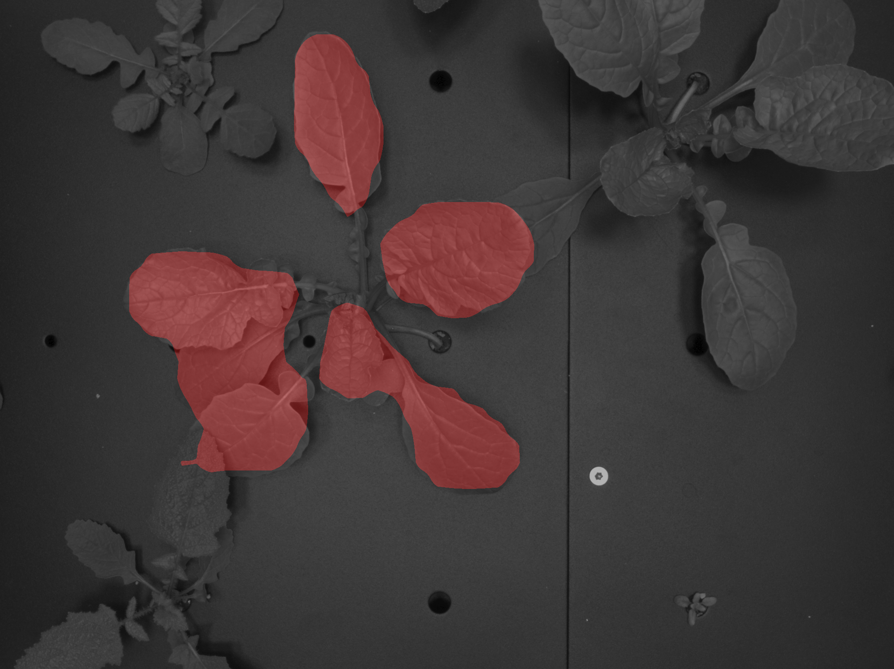
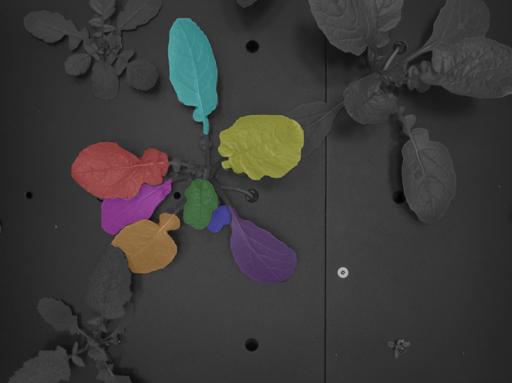

  

# Project #74: Leaf tracker plant species proof

---
This page was created by the [AI4Life project](https://ai4life.eurobioimaging.eu) using data provided by Sofia Bengoa Luoni in [Wageningen University](https://www.wur.nl/en/wageningen-university.htm).

If any of the instructions are not working, please [open an issue](https://github.com/ai4life-opencalls/project_11/issues) or contact us at [ai4life@fht.org](ai4life@fht.org)! 

**Project challenges**: instance segmentation, tracking.

## Table of Contents
1. [Introduction](#introduction)
2. [Predition](#prediction)
3. [Training](#train-your-own-model)
4. [Conclusion](#conclusion)

## Introduction

Researchers from [Wageningen University](https://www.wur.nl/en/wageningen-university.htm) are cultivating various plants in a unique growing facility called [NPEC](https://www.npec.nl/). In each of the [NPEC](https://www.npec.nl/) chambers, plants experience identical conditions in terms of light, water, and nutrients. 
Positioned above the platform, a camera captures images of each plant at specified intervals over several weeks, enabling comprehensive monitoring of their growth and development. This camera system incorporates measurements of RGB data, as well as data from fluorescence, thermal, and hyperspectral cameras. However, the original system and analysis involve averaging measurements from both older and younger leaves of each plant. 
To gain a deeper understanding of leaf physiology and development under varying light conditions, a quantitative analysis of individual leaves is necessary. Thus, the objective of this project is to develop an AI model capable of analyzing each leaf throughout its developmental stages.

In this tutorial we will show how to segment plant leaves on an RGB image using [Detectron2](https://github.com/facebookresearch/detectron2) and track them through time with [LapTrack](https://github.com/yfukai/laptrack/tree/2a065664a58e7080a861f114ef8b11b1c673468a) package.

Here is a visualization of the resulting tracking: 

 
  

Data is provided under a CC-BY license.

Let's get started! 🚀

## Prediction
The prediction can be run using the [jupyter notebook](prediction_notebook.ipynb). 

How to run on the google collab:
1) Open the notebook in collab 
    
2) If you have GPU access, in the `Load the model` section change `device` to `cuda`
3) Update the `image_path` in the `Run predictions` section to your data folder.
4) Run the notebook! 

The notebook will generate an instance leaf mask, rough central plant mask and a leaf tracking mask for every frame in the `prediction` folder inside your data folder. 
It will also by default save visualizations of the resulting masks in `visualization` folder inside `predictions`: 

 

 

## Instance segmentation training
First, we created a pretrain detection model using [detectron2](https://github.com/facebookresearch/detectron2) using data from [PhenoBench](https://www.phenobench.org/) dataset. 
Then, the pre-train was fine-tuned on the user's data.   

All the annotations were performed using [labelme](https://github.com/labelmeai/labelme) and [AnyLabeling](https://github.com/vietanhdev/anylabeling) AI assisted tool.

Training code: Work in progress! 

## Conclusion
In this tutorial, we showed how to use 
[AI4Life](https://ai4life.eurobioimaging.eu)  is a Horizon Europe-funded project that brings together the computational and life science communities. 

AI4Life has received funding from the European Union’s Horizon Europe research and 
innovation programme under grant agreement number 101057970. Views and opinions 
expressed are however those of the author(s) only and do not necessarily reflect those 
of the European Union or the European Research Council Executive Agency. Neither the 
European Union nor the granting authority can be held responsible for them.
