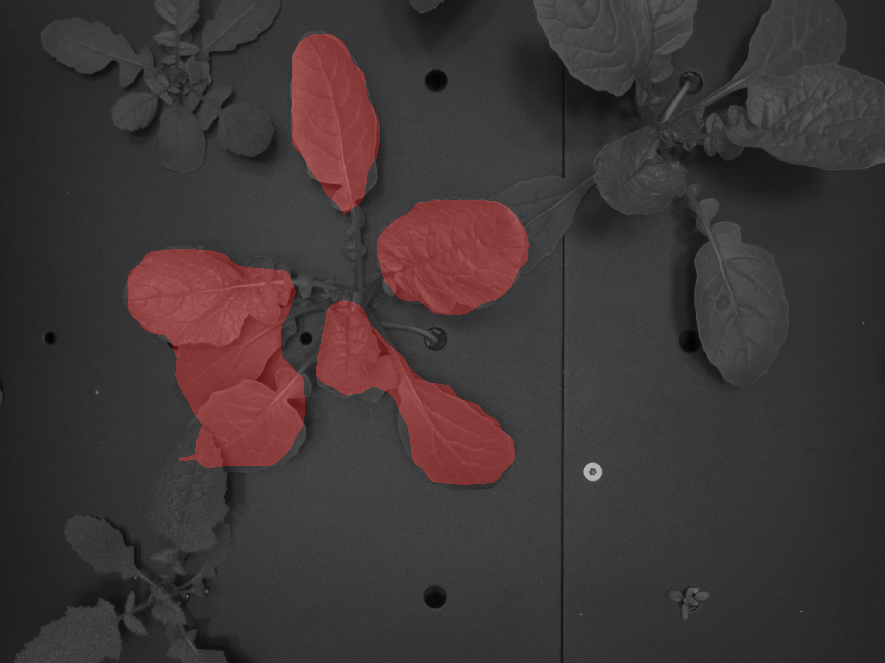
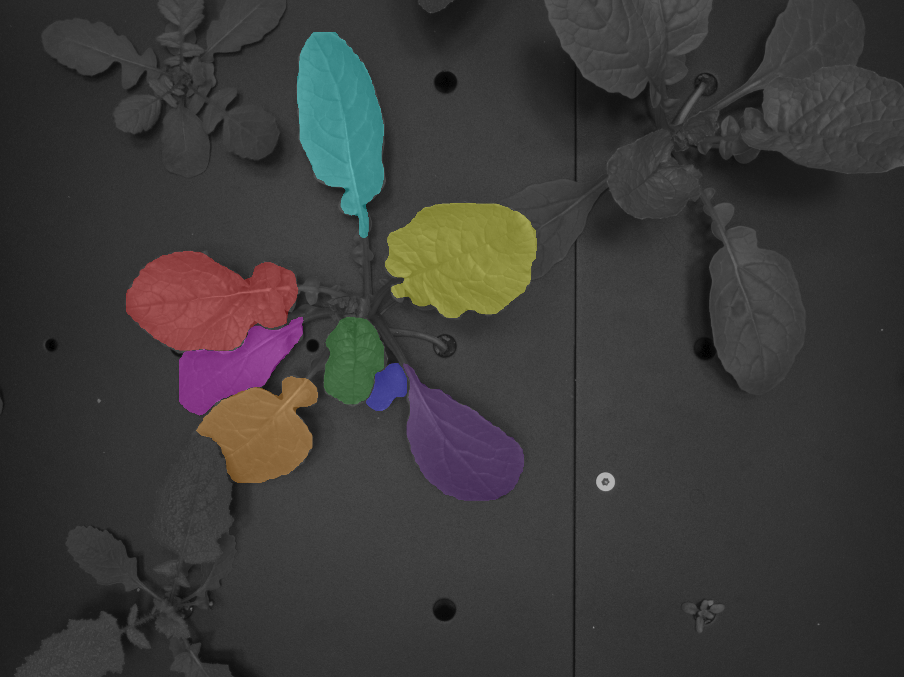

<p align="center">
  <a href="https://ai4life.eurobioimaging.eu/open-calls/">
    
  </a>
</p>

# Project #74: Leaf tracker plant species proof

---
[](https://doi.org/10.5281/zenodo.14418900)


This page was created by the [AI4Life project](https://ai4life.eurobioimaging.eu) using data provided by Sofia Bengoa Luoni in [Wageningen University](https://www.wur.nl/en/wageningen-university.htm).

If any of the instructions are not working, please [open an issue](https://github.com/ai4life-opencalls/project_11/issues) or contact us at [ai4life@fht.org](ai4life@fht.org)! 

**Project challenges**: instance segmentation, tracking.


## Table of Contents
1. [Introduction](#introduction)
2. [Predition](#prediction)
3. [Training](#train-your-own-model)
4. [Conclusion](#conclusion)


## Introduction

Researchers from [Wageningen University](https://www.wur.nl/en/wageningen-university.htm) are cultivating various plants in a unique growing facility called [NPEC](https://www.npec.nl/). In each of the [NPEC](https://www.npec.nl/) chambers, plants experience identical conditions in terms of light, water, and nutrients. 
Positioned above the platform, a camera captures images of each plant at specified intervals over several weeks, enabling comprehensive monitoring of their growth and development. This camera system incorporates measurements of RGB data, as well as data from fluorescence, thermal, and hyperspectral cameras. However, the original system and analysis involve averaging measurements from both older and younger leaves of each plant. 
To gain a deeper understanding of leaf physiology and development under varying light conditions, a quantitative analysis of individual leaves is necessary. Thus, the objective of this project is to develop an AI model capable of analyzing each leaf throughout its developmental stages.


In this tutorial we will show how to segment plant leaves on an RGB image using [Detectron2](https://github.com/facebookresearch/detectron2) and track them through time with [LapTrack](https://github.com/yfukai/laptrack/tree/2a065664a58e7080a861f114ef8b11b1c673468a) package.

Here is a visualization of the resulting tracking: 
<div> 
  
</div>

Data is provided under a CC-BY license.

Let's get started! 🚀

## Prediction
The prediction can be run using the [jupyter notebook](prediction_notebook.ipynb). 

How to run on the google collab:
1) Open the notebook in collab 
    <a target="_blank" href="https://colab.research.google.com/github/ai4life-opencalls/oc-1-project-74/blob/main/prediction_notebook.ipynb">
      
    </a>
2) If you have GPU access, in the `Load the model` section change `device` to `cuda`
3) Update the `image_path` in the `Run predictions` section to your data folder.
4) Run the notebook! 


<div>
 
</div> 


## Instance segmentation training
The training code lives in [`training/`](training/) and fine-tunes a Mask R-CNN (ResNet-50 + FPN) with **two classes**: `plant` (class 0) and `leaf` (class 1). The plant mask is generated automatically from the convex hull of all leaf polygons in each image, so only per-leaf annotations are required.

### 1. Dataset layout

The training script expects one folder per plant set, each containing the images and a COCO-format `annotations.json` for the leaf polygons:

```
dataset/
├── set_001_HI/
│   ├── 7-12-RGB2-G8_..._Fish Eye Corrected.png
│   ├── ...
│   └── annotations.json                             # COCO file with leaf polygons
├── set_003_BNI/
│   └── ...
└── ...
```

### 2. Install

Training requires a CUDA-capable GPU. We use [`uv`](https://docs.astral.sh/uv/) to manage the environment, but plain `pip` works too:

```bash
cd training
uv venv .venv --python 3.10
source .venv/bin/activate

uv pip install torch torchvision --index-url https://download.pytorch.org/whl/cu124
uv pip install "setuptools<70" numpy==1.24.4 pycocotools opencv-python-headless pillow
uv pip install git+https://github.com/facebookresearch/detectron2.git --no-build-isolation
```

> `setuptools<70` is pinned because detectron2 imports `pkg_resources`, which was removed in setuptools 70.

### 3. Prepare the data

`prepare_dataset.py` merges the per-set COCO files into a single `train.json` / `val.json` pair. The split is done **by set** (not by image) so all time-series frames from the same plant stay in the same split, avoiding leakage. For every image it also generates a `plant` annotation as the convex hull of its leaf polygons.

```bash
export OC1_DATASET_ROOT=/path/to/dataset
python prepare_dataset.py                              # default: 80/20 train/val split, seed 42
python prepare_dataset.py --val-fraction 0.15 --seed 0  # custom split
```

This writes `training/data/train.json` and `training/data/val.json`. Image paths inside these JSONs are stored as `<set_name>/<image>.png` and resolve against `OC1_DATASET_ROOT`.

### 4. Train

```bash
python train.py                  # 1 GPU
python train.py --num-gpus 2     # multi-GPU
python train.py --resume         # resume from last checkpoint
python train.py --eval-only      # COCO eval on the val split only
```

Hyperparameters (LR, schedule, augmentations, etc.) live in [`maskrcnn_custom_config.py`](training/maskrcnn_custom_config.py). The default config fine-tunes from the COCO Mask R-CNN R-50 FPN 3× checkpoint for 10 000 iterations at LR 2.5e-4 with horizontal flip + multi-scale training. Checkpoints, logs, and COCO eval results are written to `./output/maskrcnn_custom`.

## Conclusion
In this tutorial, we showed how to use 
[AI4Life](https://ai4life.eurobioimaging.eu)  is a Horizon Europe-funded project that brings together the computational and life science communities. 

AI4Life has received funding from the European Union’s Horizon Europe research and 
innovation programme under grant agreement number 101057970. Views and opinions 
expressed are however those of the author(s) only and do not necessarily reflect those 
of the European Union or the European Research Council Executive Agency. Neither the 
European Union nor the granting authority can be held responsible for them.
